# Spring Security Wrapper

The direct use of the Spring Security project may not be able to meet our business needs, such as the rough login page and the lack of verification code related functions. Therefore it still requires some secondary development to be used in actual production. So, in order to quickly deploy a independent, pluggable, and scalable authentication module, this project has done a certain amount secondary development work yet, To ensure minimal coupling with business code during use, and to facilitate development and testing even without security modules.

## Get started

### HTTP Status Code

​	401 Unauthorized	403 Forbidden

### Local startup

1、download the source code

```shell
git clone git@github.com:aqzhft/security.git
cd security
mvn clean package -Dmaven.test.skip=true
jar -jar security-basic/target/security-basic-${version}.jar
```

2、access address http://localhost:8080, you can see the login page

## Module introduce

| name              |                                                              |
| ----------------- | ------------------------------------------------------------ |
| security-core     | The main logic of Secondary development                      |
| security-token    | The logic of the entire process of generating, storing, and verifying verification codes |
| security-assemble | Assembling functional modules, integrating this module and implementing some<br />extensions can build a authentication module quickly |
| security-basic    | A default implementation based on springboot                 |

## Nginx mode running

1、Update basepath property
2、Update the third party app's redirect uri
3、Update the clientId and client secret by viewing the authorization server's configuration page

## Main extensions

1、Customized a login page
2、Username and password login way add verification code verification step
3、Added verifycode login logic (For example, through mobile phones、email and other third-party message push system) 
4、Customized development of third-party applications with non-standard OIDC authentication protocals added

## Deploy mode

### 1、Direct integration

Directly rely on this authentication module into the business system  in the form of a jar package, and then run it as a process. The advantage of doing so is that the operation is simple enough; However, there is also a fatal drawback, which is the high coupling between the authentication module and the business system. Then how to coordinate the dependency on other libraries (such as Java, Spring), the latest spring security authentication framework needs to support Java 17 and Spring Boot 3. I believe that many business systems still stay in lower versions. In addition, the existence of authentication modules can also cause some inconvenience in daily development and testing. Subsequent upgrades will also be a difficult problem to solve, so this method is not recommended.


### 2、Utilizing the Nginx plugin

Most production environments use nginx as a reverse proxy. nginx also provides a plug-in called ngx_http_auth_request_module, please refer to( http://nginx.org/en/docs/http/ngx_http_auth_request_module.html ) for more details. When a request passes through the nginx server, this plugin can be used to first forward the request to the specified authentication interface, determine the relevant authentication and authorization issues, and then proceed with subsequent processing based on the returned results. If this is the case, the authentication module can be deployed independently, and even unrelated business systems can share this authentication module, The advantage of doing so is that the impact of the authentication module on the business system and the coupling is reduced as much as possible.



### 3、JWT

For business applications, a JWT parsing tool can be installed, and then the public key can be used to determine whether the request has permission related issues. If the business application is split more, JWT verification related work can be placed in the gateway module for processing, and then the gateway can distribute normal requests to specific business modules. The front-end first requests the authentication module to obtain token information, and then requests to carry token information through JWT verification and filtering before accessing the business system. Using JWT is a relatively general operation, where services can become stateless, but accessing websites on the browser side may still require the ability to maintain the session, which requires some additional work.

